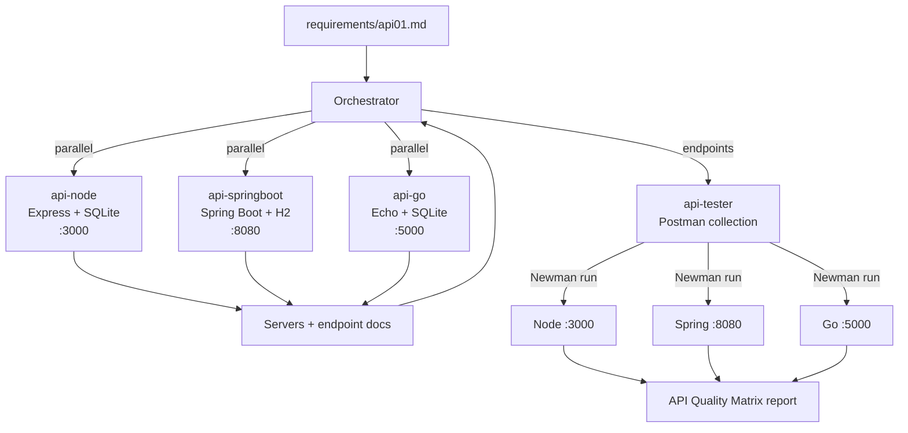

# Workshop: Claude Agent APIs

Multi-agent workflow that builds the **same REST API** in three runtimes (Node.js, Spring Boot, Go) from one requirement file, then verifies they behave identically with Postman/Newman.

## Agents

Defined in [.claude/agents/](.claude/agents/):

| File | Agent | Role | Stack | Port |
|------|-------|------|-------|------|
| [orchestrator.md](.claude/agents/orchestrator.md) | `orchestrator` | Parses the requirement, dispatches builders in parallel, triggers testing | - | - |
| [api-node.md](.claude/agents/api-node.md) | `api-node` | Builds the API | Express (ESM) + built-in SQLite (`dev.db`) | 3000 |
| [api-springboot.md](.claude/agents/api-springboot.md) | `api-springboot` | Builds the API | Spring Boot 4, Java 21+, JPA, in-memory H2 | 8080 |
| [api-go.md](.claude/agents/api-go.md) | `api-go` | Builds the API | Echo v4 + file-based SQLite | 5000 |
| [api-tester.md](.claude/agents/api-tester.md) | `api-tester` | Writes the collection, runs Newman against all three, reports parity | Postman v2.1 + Newman | - |

## Flow



1. **Parse**: the orchestrator reads the requirement (resource schema, endpoints, validation rules).
2. **Build (parallel)**: `api-node`, `api-springboot` and `api-go` each implement the API with identical camelCase payloads.
3. **Gather**: the orchestrator collects server code and docs from each runtime.
4. **Test**: `api-tester` creates `api_tests.postman_collection.json`, using `{{baseUrl}}:{{port}}` variables.
5. **Verify**: Newman runs the same collection against ports 3000, 8080 and 5000.
6. **Report**: an API Quality Matrix shows whether all three stacks conform to the same contract.

## Requirement

[requirements/api01.md](requirements/api01.md): **Device IoT Registry API**

- Resource: `id`, `deviceName`, `deviceType` (sensor/actuator/gateway), `macAddress`, `status` (default `offline`), `telemetryInterval`, `createdAt`
- Endpoints under `/api/v1/devices`: `POST`, `GET`, `GET /:id`, `PUT /:id`, `DELETE /:id`
- Expected codes: 201, 200, 404, 400, 204
- Persistence: SQLite (Node/Go) survives restarts; H2 (Spring Boot) is fresh on each start

## Prerequisites

- [Claude Code](https://claude.com/claude-code) CLI
- Node.js (version with built-in `node:sqlite`, 22.5+)
- JDK 21+ and Maven
- Go 1.21+ (a CGO toolchain if the agent picks `mattn/go-sqlite3`; `modernc.org/sqlite` needs none)
- Newman: `npm install -g newman`

## Steps to run

1. **Open Claude Code** in this directory so it picks up the agents in `.claude/agents/`:

   ```bash
   cd workshop-claude-agent-apis
   claude
   ```

2. **Check the agents are loaded**: run `/agents` and confirm the five agents appear.

3. **Start the orchestrator** with the requirement file:

   ```text
   Use the orchestrator agent to implement requirements/api01.md
   ```

   The orchestrator dispatches the three builders in parallel, then hands off to `api-tester`.

4. **Start the servers** (if the agents haven't already), each in its own terminal. The folder names below are examples; use whatever the agents generated.

   ```bash
   # Node.js  -> :3000
   cd node-api && npm install && npm run dev

   # Spring Boot -> :8080
   cd springboot-api && mvn spring-boot:run

   # Go -> :5000
   cd go-api && go run .
   ```

5. **Run the Newman parity check**:

   ```bash
   newman run api_tests.postman_collection.json --env-var "baseUrl=http://localhost" --env-var "port=3000"   # Node.js
   newman run api_tests.postman_collection.json --env-var "baseUrl=http://localhost" --env-var "port=8080"   # Spring Boot
   newman run api_tests.postman_collection.json --env-var "baseUrl=http://localhost" --env-var "port=5000"   # Go
   ```

6. **Verify persistence**: create a device, restart each server and `GET /api/v1/devices`.
   - Node and Go should still return the device (SQLite file).
   - Spring Boot should return an empty list (in-memory H2).

7. **Read the report**: `api-tester` outputs the API Quality Matrix. Every runtime should pass the same assertions.

## Running a single agent

To run one runtime on its own:

```text
Use the api-node agent to implement requirements/api01.md
```

Swap in `api-springboot` or `api-go` for the others. To test servers that are already running:

```text
Use the api-tester agent to test all three APIs from requirements/api01.md
```

## Project layout

```text
.
├── .claude/agents/        # agent definitions
├── requirements/api01.md  # API specification
└── README.md
```

The agents generate the API projects and the Postman collection when they run.
